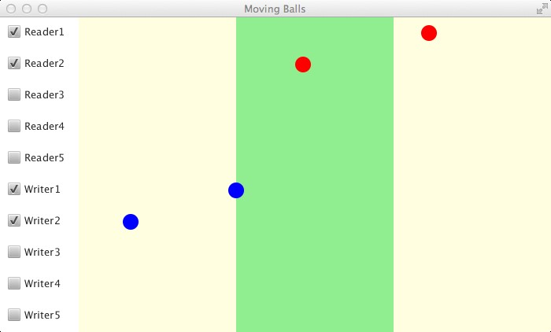

# UC_Week_7
Fontys UC opdracht week 7


## Inleiding opdracht UC, week 7

We gaan het monitor concept toepassen op het lezers/schrijvers probleem.
Om het geheel aanschouwelijk te maken doen we dit bij een applicatie die ballen van links naar rechts laat bewegen. De ballen passeren hierbij een licht-groen gebied, de Critical Section. 

Er zijn 2 rollen die een bal kan hebben: 
-	Lezer (rood) en 
-	Schrijver (blauwe).




## Doelstellingen
-	ervaring opdoen met het toepassen van een monitor
-	het lezers/schrijvers probleem oplossen, in verschillende varianten

### Stappen

Open het project MovingBallsFX in Netbeans. 
In het package movingballsfx vinden we vier klassen: 
- <code>Ball</code>, 
- <code>BallRunnable</code>,
- <code>Role</code> en 
- <code>MovingBallsFX</code>. 

De positie en de rol van een bal worden bijgehouden in een instantie van de klasse <code>Ball</code>. Deze klasse heeft public methoden <code>isEnteringCs()</code> en <code>isLeavingCs()</code> die je kunt aanroepen om te kijken of een bal op dat moment de Critical Section (het licht-groene gebied) binnengaat of juist verlaat. 

De beweging van een bal wordt geanimeerd door een instantie van de klasse <code>BallRunnable</code>. Bij het activeren van een checkbox wordt een thread gestart die een <code>BallRunnable</code> gaat uitvoeren. 

Deze thread krijgt een interrupt als de checkbox gedeactiveerd wordt. Elke bal wordt dus door een eigen thread voortbewogen. Bekijk in MovingBallsFX, in methode <code>checkBoxMouseClicked()</code>, hoe het starten en interrumperen van threads gedaan wordt.


## Opdracht 7.1
•	Voeg de monitor klasse (ReaderWriterMonitor.java) voor het lezers/schrijvers probleem aan dit project toe. 

```java

public class ReaderWriterMonitor implements RWMonitorInterface {

    /**
     * I try to avoid synchronizing on 'this' because that would allow everybody
     * from the outside who has a reference to the object to block synchronization.
     * Instead, I create a local, private, synchronization object
     */
    private final Object syncObject = new Object();

    @Override
    public void enterReader() throws InterruptedException {

    }

    @Override
    public void enterWriter() throws InterruptedException {
        synchronized (syncObject) {
            // do something thread-safe
        }
    }

    @Override
    public void exitReader() {

    }

    @Override
    public void exitWriter() {

    }
}


```

Er is verder iets wat me stoort in de klasse <code>Ball</code>. De code voor het ingaan en uitgaan van de kritieke zone test op gelijkheid.
doordat de snelheid een random waarde is is de kans op gelijkheid klein. De huidige code ziet er als volgt uit:

```java
    public boolean isEnteringCs() {
        return xPos == minCsX;
    }
    
    public boolean isLeavingCs() {
        return xPos == maxCsX;
    }

```

Ik wil deze code aanpassen door te controleren of de x-waarde in de kritieke zone is en in de vorige controle buiten de kritieke zone en vice-versa.


Deze monitor is al voor een groot deel in de sheets gegeven, en de interface is ook aanwezig in het project, maar er moet nog een complete klasse van gemaakt worden. Met behulp van deze monitor moeten we ervoor zorgen dat de ballen zich gedragen zoals vereist in het lezers/schrijvers probleem, dus:
-	meerdere READERS (rode ballen) tegelijk in het licht-groene gebied is toegestaan, en
-	een WRITER (blauwe bal) in het licht-groene gebied moet altijd alleen zijn.

•	Bepaal voordat je gaat coderen, welke tellers en signals netjes afgehandeld moeten worden als er een interrupt optreed tijdens een await in de methoden enterReader en enterWriter. Bepaal ook waar deze methoden zelf een InterruptedException  opwerpen.
•	Creëer een object van deze monitor klasse en voeg deze toe aan MovingBallsFX.

## Opdracht 7.2
•	zorg dat alle BallRunnables ditzelfde monitor object gebruiken. Je kan dit doen door een referentie naar dit object als parameter van de constructor aan de BallRunnables door te geven
•	Zorg dat de BallRunnables op de juiste momenten de juiste monitor-methodes aanroepen. Let op dat de methoden enterReader() en enterWriter() een InterruptedException opwerpen, die moet dus afgevangen worden met een try catch. 
•	Print in elke catch van BallRunnables voorlopig alleen een string naar System.out, die aangeeft wat voor role de bal heeft, en wanneer de thread geinterrupt is (buiten de Critical Section, binnen de Critical Section, wachtend op toegang tot Critical Section)

## Opdracht 7.3
•	Rethrow exceptions in BallRunnables tijdens wachten op toegang tot de Critical Section, zodat alle exceptions afgevangen worden in het buitenste catch block. Om dit goed te kunnen afhandelen moet je je afvragen:
-welke monitor methoden moet ik in de catch hier aanroepen om de monitor in een nette toestand achter te laten, en de run methode netjes te beeindigen.

 
## Opdracht 7.4
•	Pas de monitor zo aan dat blauwe ballen altijd voorrang hebben: 
o	rode ballen mogen niet meer het licht-groene gebied in zodra er een blauwe bal aan het wachten is, en
o	als er zowel blauwe als rode ballen wachten krijgen de blauwe ballen voorrang.

## Opdracht 7.3
•	Zorg nu dat het ook goed gaat als de bal weggehaald wordt terwijl die aan het wachten is om het licht-groene gebied binnen te gaan, of terwijl deze in het licht-groene gebied (de critical section) zit (hiervoor moet je wellicht een extra variabele toevoegen, zodat je weet  of de bal in het licht-groene gebied zit of niet).
